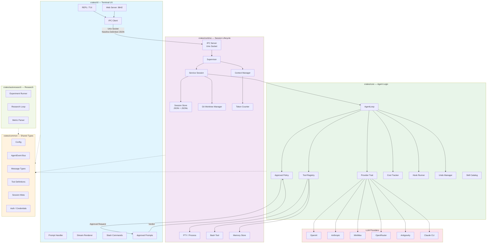
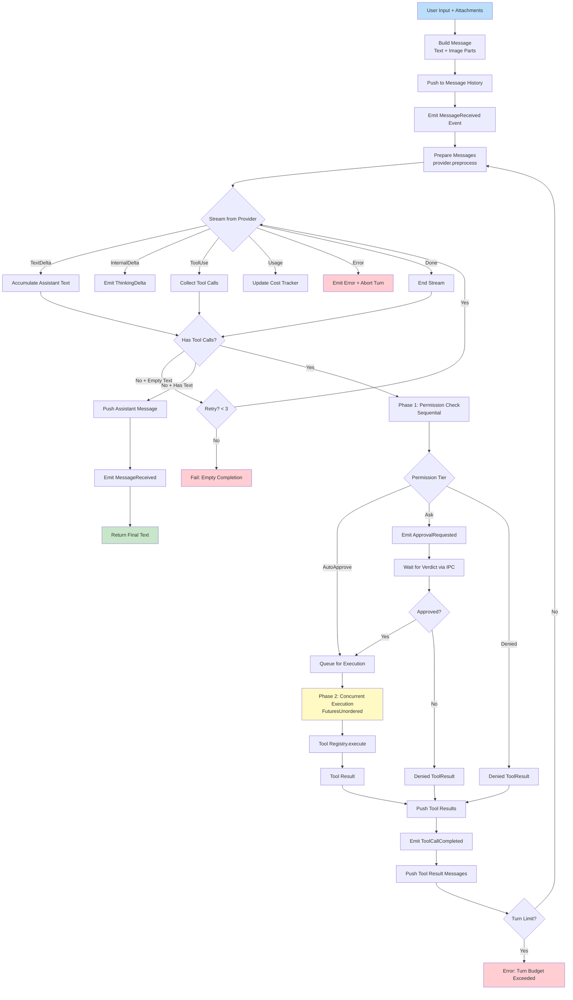
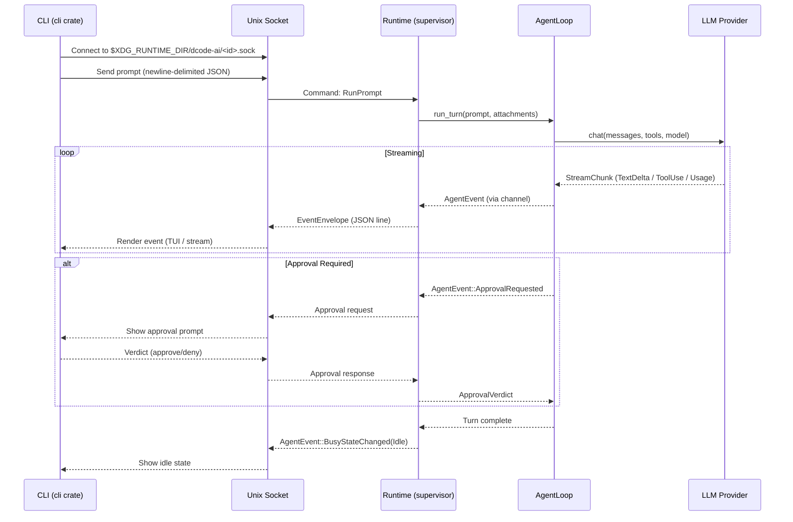
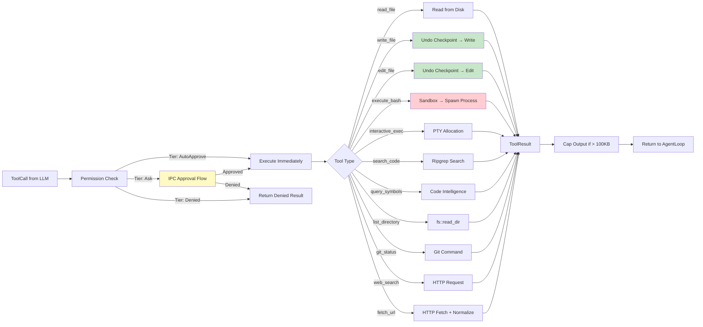
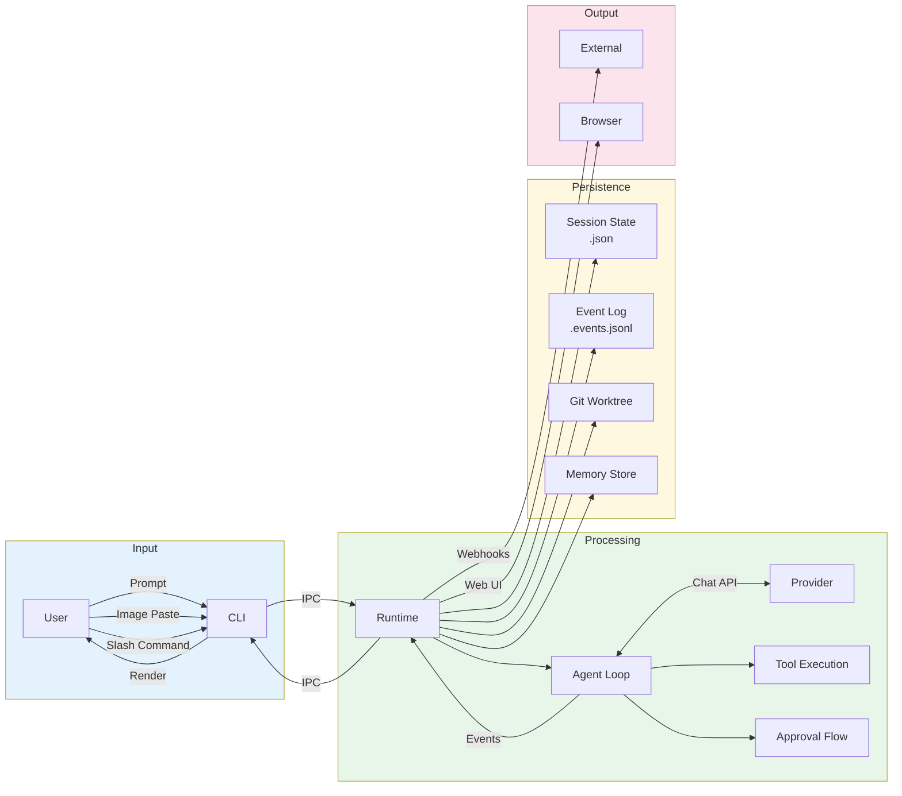
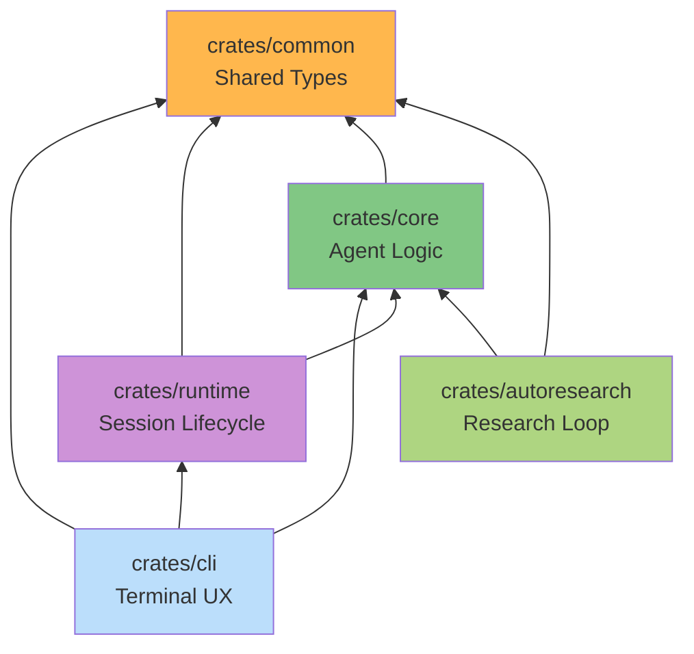

# dcode-ai Architecture Flow Diagram

## High-Level Architecture



## Agent Loop — Single Turn Flow



## Session Lifecycle

```mermaid
stateDiagram-v2
    [*] --> Created : Supervisor::create() or ::resume()

    Created --> Running : run_turn_with_images()
    Running --> Running : Turn completes, await next prompt
    Running --> Paused : Cancel / User Exit (turn aborted)
    Running --> Failed : Error (provider, tool, budget)

    Paused --> Running : New prompt arrives
    Paused --> Resumed : Supervisor::resume()

    Resumed --> Running : run_turn_with_images()

    Failed --> [*]
    Paused --> Finished : Shutdown / User Exit
    Running --> Finished : Session End
    Resumed --> Finished : Session End

    Finished --> [*] : persist state + close event log
```

## IPC Communication Flow



## Tool Execution Pipeline



## Data Flow Summary



## Crate Dependency Graph


